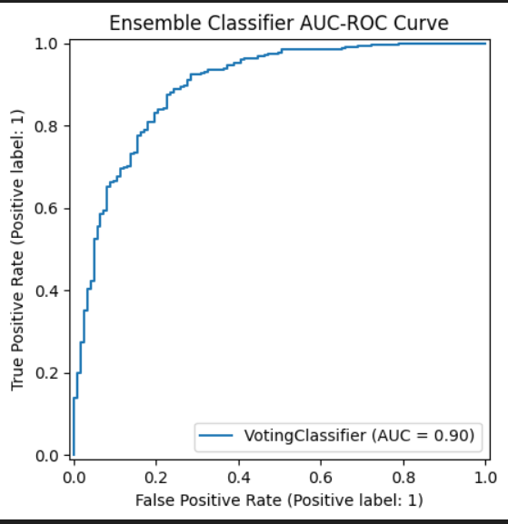

# Breast Cancer Outcome Prediction Using Machine Learning

This project applies machine learning to predict two critical outcomes for breast cancer patients:

+ Survival Status — Will the patient survive? (Classification)

+ Progression-Free Months — How long until the disease progresses? (Regression)

By analysing real clinical features and applying ML techniques, this project demonstrates how data-driven models can support more accurate healthcare decisions.

# Project Highlights
 ## Objective

Build predictive models that use clinical attributes (e.g., stage, tumour characteristics, hormone status) to forecast patient outcomes.

## Tech Stack

Python · Pandas · NumPy · Scikit-learn · Matplotlib · Seaborn
Logistic Regression · KNN · Naïve Bayes · Decision Trees · SMOTE

## Key Achievements

Below are the real performance results achieved by the models, extracted from the analysis report:

Logistic Regression was selected as the primary classifier due to its simplicity and interpretability, while an ensemble model was also evaluated and achieved higher AUC performance.

## Ensemble Model Performance

A soft-voting ensemble (Logistic Regression + Naïve Bayes) achieved an AUC of 0.90,
indicating strong class separability. Despite this, Logistic Regression was retained
as the main model due to its transparency and clinical interpretability.

 ## Classification (Survival Status)

+ Logistic Regression (Best Model):

Accuracy: 0.89  Recall: 0.98  F1-score: 0.94  AUC-ROC: 0.66

+ Naïve Bayes:

Accuracy: 0.86  Recall: 0.94  F1-score: 0.92  AUC-ROC: 0.67

+ KNN (k=12):

Accuracy: 0.88  Recall: 0.97  F1-score: 0.93  AUC-ROC: 0.67

+ Regression (Progression-Free Months)

Decision Tree DT-1 (Fully Grown):

MAE: 16.74  MSE: 415.31  R²: 0.25

Decision Tree DT-2 (Pruned to Depth 4):

MAE: 16.98  MSE: 424.68  R²: 0.24

These results demonstrate strong predictive ability for classification and reasonable interpretability and stability for regression.

## Repository Structure
├── colab_notebooks/     # All ML notebooks (cleaning, modelling, evaluation)

├── Data/                # Dataset used for modelling

├── report/              # Full machine learning coursework report

└── README.md

## Notebooks Overview

## Notebook 1 — Data Cleaning & EDA

+ Dropped irrelevant columns (Patient ID, Profession)

+ Encoded categorical variables (ER/PR status, staging)

+ Imputed missing values and handled outliers

+ Explored class imbalance and visualised key trends

## Notebook 2 — Classification & Regression Models

+ Split and stratified data for fair evaluation

+ Built Logistic Regression, Naïve Bayes, KNN

+ Evaluated using Recall, F1-score, AUC-ROC

+ Applied GridSearchCV for improved performance

+ Built regression models to predict survival months

## Notebook 3 — Ensemble Learning & Final Insights

+ Combined models using soft-voting ensemble

+ Visualised Decision Tree regressors

+ Identified which features influence predictions most

+ Summarised clinical and ethical considerations

## Real-World Impact

+ Machine learning offers powerful advantages in breast cancer care:

+ Early identification of high-risk patients

+ Better treatment planning through prediction insights

+ Support for oncologists with objective, data-driven evidence

+ Helping move toward precision medicine

This project demonstrates how ML models — when used responsibly — can assist healthcare professionals rather than replace them.

## Author Hamza Hassan - Final-Year Computer Science Student, Cloud & DevOps Enthusiast

## 📫 Connect with Me
[LinkedIn](https://www.linkedin.com/in/hamzahassan21/)
[Youtube](https://www.youtube.com/channel/UC51JEAEBV8WXwf2ZLROvUJw)
